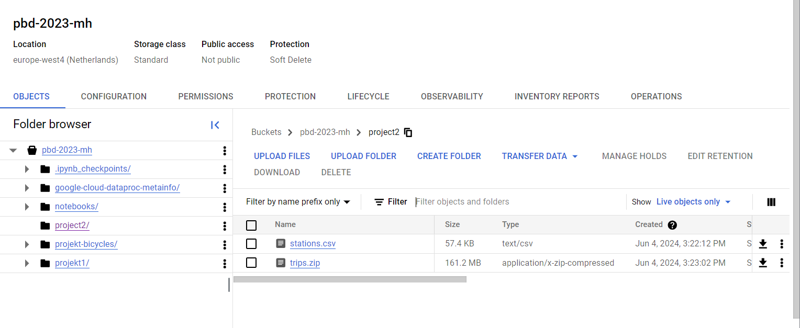
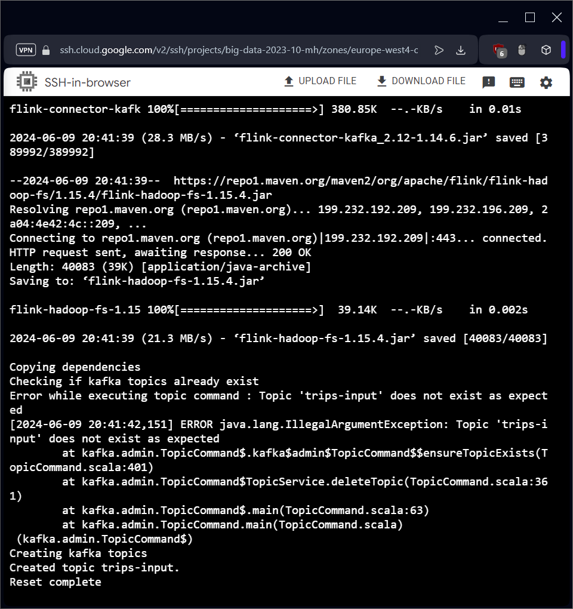
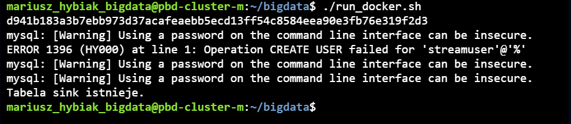
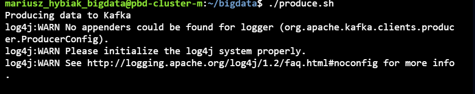
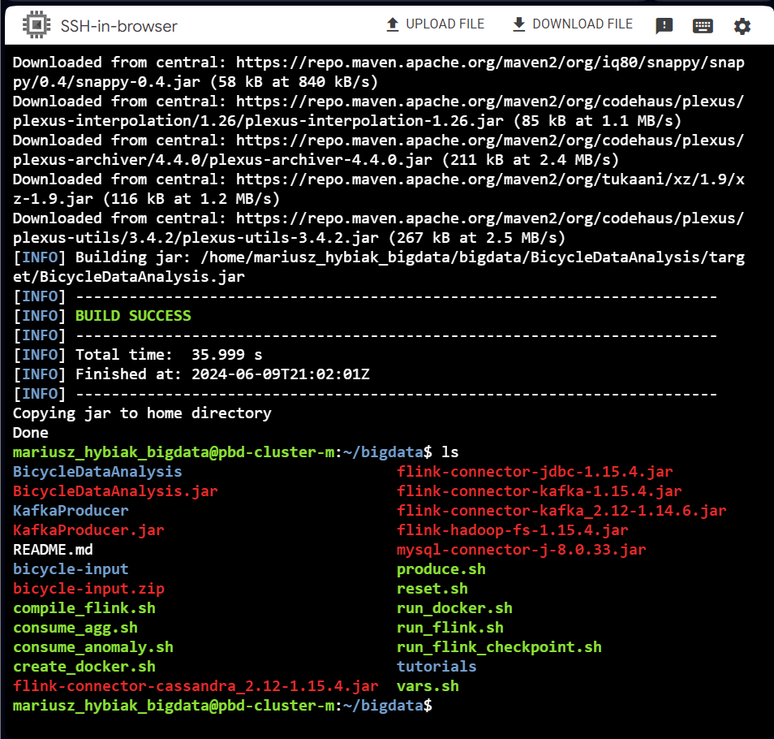

# Instrukcja uruchomienia

## Pobranie plików

1. Pobierz zbiór danych z zestawu 5 z ekursów.
2. Zmień nazwę pliku .csv na `stations.csv`, a pliku .zip na `trips.zip`.
3. Prześlij pliki do bucketa i umieść w katalogu `project2` tak, by ścieżki wyglądały następująco:
    - `gs://pbd-2023-mh/project2/stations.csv`
    - `gs://pbd-2023-mh/project2/trips.zip`



## Uruchomienie klastra
1. Uruchom klaster następującym poleceniem. Możesz zmienić czas działania klastra na inny niż 10h.
```sh
gcloud dataproc clusters create ${CLUSTER_NAME} --enable-component-gateway --region ${REGION} --subnet default --master-machine-type n1-standard-4 --master-boot-disk-size 50 --num-workers 2 --worker-machine-type n1-standard-2 --worker-boot-disk-size 50 --image-version 2.1-debian11 --optional-components ZOOKEEPER,DOCKER,FLINK --project ${PROJECT_ID} --max-age=10h --metadata "run-on-master=true" --initialization-actions gs://goog-dataproc-initialization-actions-${REGION}/kafka/kafka.sh
```

## Pobranie projektu

1. Pobierz pliki z ekursów lub sklonuj projekt bezpośrednio na klaster.
2. Przejdź do katalogu z projektem.
3. Nadaj uprawnienia dla plików wykonywalnych poleceniem `chmod +x *.sh`.
4. Edytuj plik ze zmiennymi np. poleceniem `nano vars.sh`. Podaj swoją nazwę bucketa.
5. Załaduj zmienne środowiskowe poleceniem `source vars.sh`.
    - jeśli jakieś polecenie nie wykonuje się prawidłowo, sprawdź czy zmienne zostały poprawnie załadowane. Spróbuj zrobić to ponownie.
6. Uruchom skrypt `reset.sh` w celu zresetowania środowiska oraz pobrania i zainstalowania wszystkich zależności. Skrypt:
    - kopiuje z Bucketa plik zip z przejazdami i rozpakowuje go
    - Pobiera dependencje z mavena i kopiuje je do katalogu flink/lub
    - Usuwa temat kafki dla strumienia wejściowego
    - Tworzy temat Kafki dla strumienia wejściowego
7. Upewnij się, że wszystkie pliki zostały pobrane i zainstalowane poprawnie.
8. 


## Uruchomienie bazy danych

1. Zajrzyj do pliku `run_docker.sh`.
2. Uruchom skrypt.
3. Skrypt powinien stworzyć kontener z bazą danych.
4. Sprawdź czy kontener działa poleceniem `docker ps`.
5. Wejdź do kontenera i sprawdź czy widzisz bazę danych oraz tabelę `aggsink`.



## Uruchomienie zasilania danymi strumienia

1. Zajrzyj do pliku `produce.sh`.
2. Uruchom skrypt (korzysta on z pliku `KafkaProducer.jar`).
   - kod źródłowy znajduje się w katalogu `KafkaProducer`.
3. Skrypt powinien wysyłać dane do tematu Kafki.



## Uruchomienie aplikacji Flink

1. Wykorzystaj dostarczony .jar lub skompiluj go samodzielnie.
2. Uruchom kompilację poleceniem `compile_flink.sh`. Plik BicycleDataAnalysis.jar powinien zostać przekopiowany do katalogu w którym jesteś.



3. Uruchom aplikację poleceniem `run_flink.sh`.
4. Zwroć uwagę na parametry aplikacji.
5. Dane po przetwarzaniu powinny zostać zapisane w bazie danych.

## Konsumpcja wyników

1. Użyj skruptu `consume_agg.sh` do konsumpcji danych z bazy danych.

## Informacje o przetwarzaniu

```java
        DataStream<Trip> tripsDS = env.fromSource(
                Connectors.getTripsSource(properties),
                WatermarkStrategy
                        .<Trip>forBoundedOutOfOrderness(Duration.ofHours(1))
                        .withTimestampAssigner((event, timestamp) -> event.getEventTime().toEpochSecond(ZoneOffset.UTC) * 1000),
                "Trips Source"
        );
```
Odpowiada za wczytanie danych z tematu Kafki. 

```java
        String path = properties.get(Parameters.STATION_INPUT_FILE);
        DataStream<Station> stations = env.readTextFile(path)
                .map(a -> a.split(","))
                .filter(a -> !a[0].equals("ID"))
                .map(a -> new Station(
                        Integer.parseInt(a[0]),
                        a[1],
                        Integer.parseInt(a[2]),
                        Integer.parseInt(a[3]),
                        a[4],
                        a[5],
                        a[6],
                        a[7] + " " + a[8]

                ));
```
Odpowiada za wczytanie danych z pliku CSV.

```java
        KeyedStream<Trip, Integer> keyedTrips = tripsDS.keyBy(Trip::getStationId);
        KeyedStream<Station, Integer> keyedStations = stations.keyBy(Station::getId);

        DataStream<TripStation> tripStationDS = keyedTrips
                .join(keyedStations)
                .where(Trip::getStationId)
                .equalTo(Station::getId)
                .window(TumblingProcessingTimeWindows.of(Time.seconds(10)))
                .apply(new TripStationJoinFunction());

        DataStream<StationAggregate> aggOutput = tripStationDS
                .map(StationAggregate::fromTripStation)
                .keyBy(StationAggregate::getId)
                .window(TumblingProcessingTimeWindows.of(Time.days(1)))
                .reduce((a, b) -> new StationAggregate(
                        a.getId(),
                        a.getStart() + b.getStart(),
                        a.getStop() + b.getStop()
                ));
```

Odpowiada za połączenie danych i ich przetwarzanie. W ramach stacji są zliczane przyjazdy i odjazdy rowerów. Wyniki są agregowane w oknach czasowych.

```java
        aggOutput.addSink(Connectors.getAggSink(properties));
```
Odpowiada za zapisanie wyników do bazy danych.

```java
Jako ujście został wykorzystany temat Kafki:

```java
public static KafkaSink<String> getAnomalySink(ParameterTool properties) {
    return KafkaSink.<String>builder()
            .setBootstrapServers(properties.get(Parameters.BOOTSTRAP_SERVERS))
            .setRecordSerializer(KafkaRecordSerializationSchema.builder()
                    .setTopic(properties.get(Parameters.ANOMALY_OUTPUT_TOPIC))
                    .setValueSerializationSchema(new SimpleStringSchema())
                    .build()
            )
            .setDeliverGuarantee(DeliveryGuarantee.AT_LEAST_ONCE)
            .build();
}
```
Odpowiada za zapisanie wyników anomalii do tematu Kafki.

## Dodatkowe informacje

- W pliku `consume_anomaly.sh` znajduje się skrypt do konsumpcji danych dotyczących anomalii (wykrywania anomalii nie zaimplementowano).
- Udało mi się przetestować i potwierdzić, że program działa poprawnie do etapu połączenia dwóch strumieni i zapisania tego do bazy danych.
